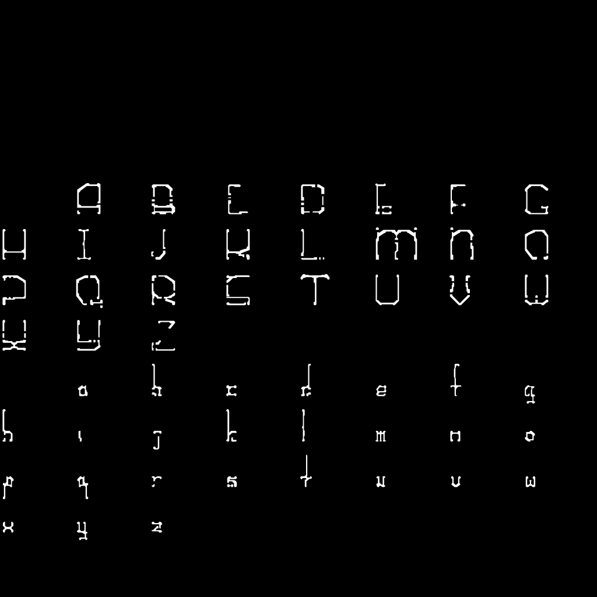
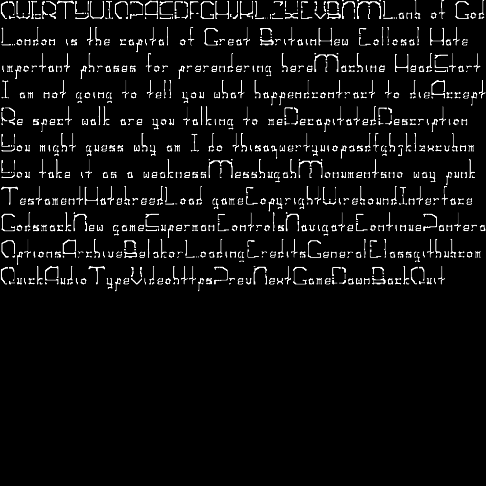

# WireboundTextBaker
*Supplement for the main project [Wirebound](https://github.com/pol-31/Wirebound)*


<a href="https://github.com/pol-31/Wirebound">
    
</a>

**WireboundTextBaker** is used for two purposes:
- Generate bitmaps from `.ttf` files with configurable options such as font size and symbol selection. It also allows you to provide a text localization file to scan for more frequent characters, which will be added to the bitmaps.
- Prerender phrases to textures, tightly packing them. This process outputs a `.png` file and a `.h` file with texture coordinates. If the [gperf](https://www.gnu.org/software/gperf/) command is available, it also generates a perfect hash function for the provided English localization (see explanation below).

The application allows you to choose one or both functions.

## Details
### Bitmap Generation
1. Bitmaps contain 12 rows and 8 columns, totaling 96 symbols. You can change this, but you will need to refactor the approach to find specific rows and columns since bitshift operations are currently used (replacing these is not recommended as they are optimized for both Wirebound and WireboundTextBaker).

2. To generate bitmaps, provide a bitmap info file that follows these rules. Adding it at the beginning is encouraged:
```
--- --- --- METADATA (first 20 rows will be skipped) --- --- ---
8 columns, 12 rows, 96 chars max; name and font_path are necessary.
name = no extension, no parent path; filename = name + extension;
path = filename + parent path.
If no resolution provided (or it's invalid) - default value 512 is used.
Symbols to generate may be wrapped in "" and can contain indents;
should be represented in hex format with 6 symbols (e.g., 0xFFFF) and
separated by commas ','.
Symbol ranges are described with '-' (inclusive), e.g., 0x0020-0x007E.
autogen('y') or glyph mapping data:
- use 'y' to autogen symbols (everything else is considered "no");
- if the file is already generated, glyph mapping data is stored here.
  Autogen symbols don't contain ASCII symbols (they should always be stored in a separate bitmap). Width data is represented as:
  float factor (uint32), int width min (uint32), int height (uint32),
  int full height (uint32) - including between-line space and
  std::vector<uint8_t> widths (uint8).
  localization path is optional and used for symbols autogen
  (it would be scanned for more frequent chars).
  name; font path (.ttf); resolution; symbols to generate; autogen('y') or glyph mapping data; localization path;
```

**Example entries:**
```
bmp_ascii_header;/home/pavlo/Desktop/font_text.ttf;1024;"0x0020-0x007E";n;;
bmp_cyrillic_text;/home/pavlo/Desktop/Arial.ttf;1024;"
0x0410-0x044F,
0x0401,0x0404,0x0406,0x0407,
0x0451,0x0454,0x0456,0x0457,
0x0490,0x0491
";n;;
bmp_korean_header;/home/pavlo/Desktop/NotoSansKR-VariableFont_wght.ttf;1024;;y;/home/pavlo/Desktop/localization/ko.txt;
```
**Note:** At least one ASCII bitmap should be added if you want to prerender phrases. This is important because all localization in Wirebound uses Arabic numbers and some English words (e.g., key binding at settings).

3. Localization files should have a specific structure. They also have metadata info and at least one "section" with all the text for Wirebound. The text section is also used for bitmap character autogeneration (see explanation above) and contains all text. For prerendering, they can contain _prerendering sections_ with font info (name, size, bitmap name, .ttf, etc.). This is useful for prerendering with different fonts or sizes (e.g., separation header/text).

The file should start with metadata:
```
METADATA
line with section 1 info; section 2; ... ; n; line with main text section;
```

For example, if section_info_1 starts at line 27, section_info_2 at line 61, and the text section starts at 147, you should write:
```
METADATA
26;61;147;
```
That also means lines 3-26 will be ignored.

Prerendering sections contain _phrases_. Phrases are short keywords or sentences that should be short enough to render on screen in one line. In Wirebound, we prerender all main menu settings and inventory words for fast rendering.

**Phrase info fields:**

```
name; ascii bitmap name; ascii mask bitmap name; localization bmp name; localization mask bmp name; localization font path (.ttf); text size;
```

**Notes:** 
- `name` and `ascii_bitmap_name` are required.
- All provided bitmaps should have the same resolution.
- `ascii_bitmap_name` is required because all localizations in Wirebound use Arabic numbers and some letters for key binding at settings.
- `ascii_mask_bitmap_name` is used in Wirebound as a mask for text coloring and is optional.
- `localization_bmp_name` serves as an addition to the ASCII bitmap, so if you want Cyrillic or some supplementary Latin letters for European localization, put them here.
- `localization_mask_bmp_name` is analogous to `ascii_bitmap_name`.
- `localization_font_path` support was implemented for CJK localizations, where you can't prerender all characters to bitmap (or you can, but you really don't want to render 11k symbols...).
- `text size` is self-explanatory. If no size is provided (or it's invalid), the default value is set (100).

For bitmaps, you need to write only the name (not the path), as you provide the path to the directory with localization files as a program argument.

## Hash Generation
In Wirebound, we need a hash only for the English localization because we search and primarily operate only with it. So we get its line number and then for a certain localization we directly go to that line because all sections of all localization files are the same line by line (but with different translations). So we generate a hash for English and get a `.h` header, which we can embed and use as `constexpr`. (There is no hash for text at runtime, but we can access it by line number, so it's essentially a hash.)

## Text Rendering Pipeline in Wirebound
1. We get the string `";_;"`

2.1) If the string content is known - at `constexpr` we check if it was prerendered:
   - If yes - we can directly ask for texture coordinates (happy end).
   - If no - continue.

2.2) If the string content is unknown - continue.
3) Check if it was prerendered at runtime (in runtime we keep a caching texture with all last rendered text). If yes - ask for texture coordinates (happy end).
4) Iterate through the string character by character and try to render it:
   - If the character is in the font bitmaps - ask for its coordinates.
   - If there's no bitmap with the needed character - open the `.ttf` file and render it (or throw an exception) and continue for all characters.

## Example
(see ./example for details)

1. for bitmap generation we write:
```
bmp_ascii_header;/home/pavlo/Desktop/Wirebound_header.ttf;1024;"0x0020-0x007E";n;;
```
* and get this (and some other data):



2. for phrase prerendering generation we provide example/en.txt with phrases and this:
```
en_prerendered_header;bmp_ascii_header;;;;;140;
```
and get this (and some other data including hash):

